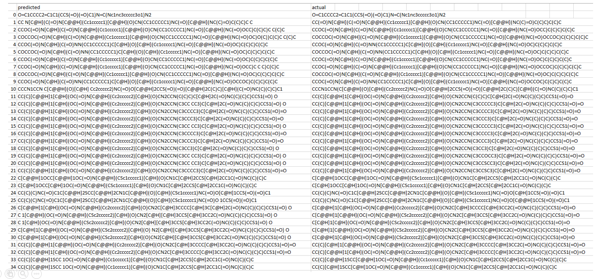
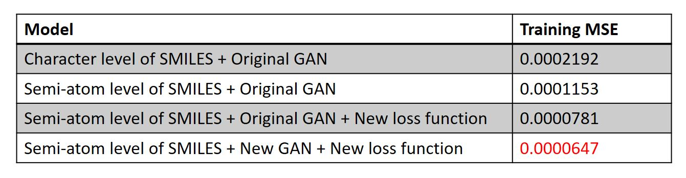

# DenovoGAN
 Drug Denovo Design using GAN for Daewoong Project
 
 
### Components:
Python version = 3.7

Tensorflow version = 2.3.0

Keras version = 2.4.3

### Preliminary:

* Create folder "data" that contains BindingDB.csv dataset

* Create folder "model_vae_comp" that containing sub folder "encoder" and "decoder" -> for saving VAE model of compound

* Create folder "model_vae_target" that containing sub folder "encoder" and "decoder" -> for saving VAE model of target

* Create folder "gan_model" to save the trained gan model

* The models and methods descriptions can be seen on "Report.pptx"

### Run the following codes for data preprocessing:
1. a_prepro_canonical.py
2. b_prepro_parse_atom.py
3. c_prepro_tochar.py
4. d_prepro_decode_atom.py
5. e_prepro_semi_atom.py

### VAE for projecting latent variable of compound:
6. f_vae_compound.py 
7. g_load_vae_compound.py (load and save the latent variable)

### VAE for projecting latent variable of target:
8. h_vae_target.py
9. i_load_vae_target.py (load and save the latent variable)

### GAN for predicting new compound:
10. j_my_gan.py
11. k_load_gan.py

### Result:

